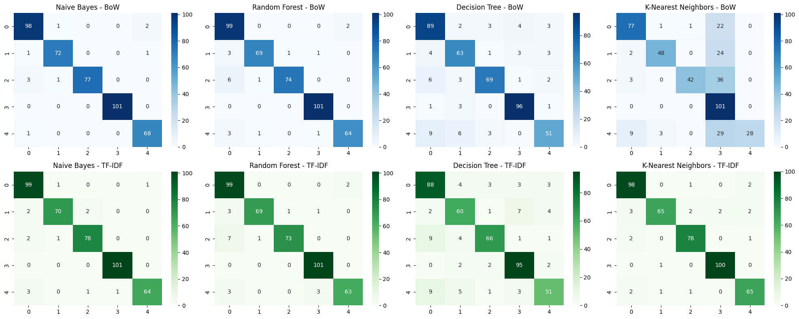

# 📰 FlipItNews NLP News Classifier

Automates news article categorization for FlipItNews, a fintech startup, using NLP to classify **2,126 articles** into Politics, Technology, Sports, Business, or Entertainment with **97.6% accuracy**.

## 🚀 Project Snapshot

* **Goal:** Build an end-to-end NLP pipeline for automated news classification to enhance personalized content delivery.
* **Dataset:** 2,126 articles across 5 balanced categories.
* **Tech Stack:** Python, NLTK, Scikit-learn, Pandas, Matplotlib, Seaborn, WordCloud.
* **Key Skills:** NLP, Text Preprocessing, Feature Engineering, Classification, Visualization.

## 📊 Dataset & Class Balance

* **Size:** 2,126 articles.
* **Categories:** Sports (23.7%), Business (23.6%), Politics (19.0%), Entertainment (17.4%), Technology (~16.3%).
* **Balance Strategy:** No severe imbalance detected, so oversampling/undersampling were skipped. Used a **stratified train-test split (80:20)** to preserve category proportions and monitored fairness via per-class precision/recall.

## 🔧 Pipeline Highlights

* **Preprocessing:** Cleaned text (lowercase, punctuation removal, custom stopwords via TF-IDF analysis), applied lemmatization for context-aware word forms.
* **Feature Engineering:** Explored Bag of Words (BoW) and TF-IDF vectorization. **BoW outperformed TF-IDF (97.6% vs. 96.7% accuracy)**.
* **Models Trained:** Naive Bayes (best: 97.6% accuracy), Random Forest, Decision Tree, K-Nearest Neighbors.
* **Evaluation:** Used Accuracy, Precision, Recall, F1 Score. Visualized results with Confusion Matrices and Word Clouds.

## 📈 Results

| Model         | BoW Accuracy | TF-IDF Accuracy |
| :------------ | :----------- | :-------------- |
| **Naive Bayes** | **97.6%** | 96.7%           |
| Random Forest | 95.5%        | 95.1%           |
| KNN           | 69.5%        | 95.3%           |
| Decision Tree | 86.4%        | 84.5%           |

* **Naive Bayes + BoW:** Top performer, ideal for balanced text classification.
* **Visuals:** Word clouds confirmed improved feature relevance post-preprocessing.
   

## 🧠 Key Takeaways

* Custom stopwords significantly boosted model performance.
* Naive Bayes excelled even over more complex models.
* BoW proved more effective than TF-IDF for this dataset's term frequency characteristics.
* Fairness was ensured through stratified splitting and per-class metric monitoring.

## 🔮 Future Enhancements

* Explore advanced NLP models (e.g., BERT).
* Automate the stopwords update.
* Implement cross-validation for robustness.
* Conduct topic modeling for deeper insights.

## 🛠 Tools Used

* Python, Pandas, NumPy
* NLTK (preprocessing)
* Scikit-learn (models, metrics)
* Matplotlib, Seaborn, WordCloud (visuals)

## 👤 About Me

**John Doe** | 🔗 [LinkedIn](https://www.linkedin.com/in/aadhisilambarasan/) | 📫 [22.aadhi@gmail.com](mailto:22.aadhi@gmail.com) | 🌐 [GitHub](https://github.com/Aadhisilambarasan)
_Passionate Data enthusiast skilled in NLP and ML._

---
⭐ Star this repo if it inspires you! Feedback welcome.
